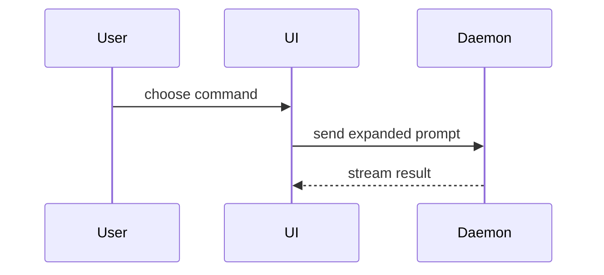

Write a PR body a reviewer takes in at a glance: the shape of the change, proof that it works, and how dangerous it is to merge. Gather the proof yourself and publish only after the user approves.

Work in a scratch dir outside the repo: `SCRATCH="${TMPDIR:-/tmp}/pr-<branch>"`. Skill files live at `~/.agents/skills/pr/`; expand `references/` and `scripts/` from there, not from the app repo.

## Steps

1. **Scope.** Fix the change range, snapshot the tree, and pick the before-tree mode (stash, branch, sidecar, or pinned) per [before-after](references/before-after.md#which-path). Classify every path in `changed.paths` as one kind:
   - **visual** — changes rendered UI;
   - **behavioral** — changes runtime behavior without changing pixels (API, logic, data, types that alter behavior);
   - **inert** — cannot change runtime behavior (docs, comments, formatting, renames with no references).

   Write each visual or behavioral change as a **claim**: one sentence a reviewer could check by looking or running. With visual paths, record kinds, claims, and representative surfaces in the shot list per [coverage](references/before-after.md#coverage).
   Done when: every changed path has a kind, every visual and behavioral path belongs to a claim, and the scope gate passes.

2. **Evidence.** Prove every claim with the smallest proof that carries it.
   - **Visual** — stills: one before/after pair per claim, served from a fingerprinted dev URL, per [claim](references/before-after.md#claim). Add a video only when the claim holds through interaction, motion, or a sequence; record it on the after tree before the stills, per [recording](references/recording.md).
   - **Behavioral** — a run that goes **red** on the before tree and **green** on the after tree, per [runs](references/before-after.md#runs). Use the narrowest existing test; when none covers the claim, use command output that shows it.
   - **Inert** — no proof; Evidence says so in one line.

   Stills and runs share one before-tree [window](references/before-after.md#window): materialize the before tree once, capture everything, restore. Probe tools where they are first needed, per [setup](references/setup.md).
   Done when: every visual claim has a validated still pair (and a validated render when a video was chosen), every behavioral claim has a validated red/green pair, and the user's tree matches its Scope snapshot. A gate exiting zero is where inspection starts: open what it lists, and a mismatch returns to the capture to repair, regenerate, and rerun.

3. **Draft.** Write `$SCRATCH/body.md` from the [template](#template) and a title per [Title](#title). Reference media by absolute `$SCRATCH` path: chat renders those during Review, and `gh --attach` rewrites them on Publish.
   Done when: every claim appears in Evidence, every referenced file exists, and anything uncertain is marked rather than invented.

4. **Review.** Present the draft per [review](references/publish.md#review) and stop. Each revision returns to the step it touches and reruns that step's gate before presenting again.
   Done when: the user gives one explicit go-ahead covering commit, push, and PR, or declines.

5. **Publish.** Commit, push, and create or update the PR per [publish](references/publish.md#publish).
   Done when: the remote PR body shows every image and video as a remote asset, or the declined path has cleaned up.

## Title

Conventional Commits: `type(scope): summary`, scope optional. Types: `feat`, `fix`, `refactor`, `chore`, `docs`, `test`, `perf`, `style`, `build`, `ci`. The commit made on Publish uses the same line.

## Template

```markdown
## Summary

<diagram, diff-sketch, or tree>

## Evidence

- **Before:** <screenshot/output/failing test run>
  **After:** <screenshot/output/passing test run>

## Merge Danger

**Door:** <one-way or two-way>

<optional: description>

**Blast Radius:** <one-word description>

<optional: potential ramifications of merge>
```

Skip all preambles and keep prose brief.

### Summary

Pick the smallest view that makes the key point clear.

- Show logic or an algorithm as pseudocode:

```text
on(save)
  if content is unchanged
    return cached result
  write new content
  return fresh result
```

- Show runtime control flow as a call tree:

```text
submitForm
  createSession
    persistPrompt
    launchAgent
  navigateToSession
```

- Show UI structure as a component tree, including state and module boundaries that matter:

```text
<SessionPage> (apps/example/src/routes/session.tsx)
  useSessionEvents()
  <SessionToolbar>
    <RunSkillButton> (packages/ui)
```

- Show file responsibility or a broad refactor as a shallow file tree:

```text
src/
├── commands/       # parses user actions
├── sessions/       # owns session state
└── transport/      # sends API requests
```

- Show component interaction, control flow, or data flow with Mermaid:



- Use `diff` when the point is what changes and the surrounding shape already exists. Match the diff shape to the topic.

For a component change:

```diff
 <SessionPage>
   useSessionEvents()
   <SessionToolbar>
+    <RunSkillButton />
   <SessionTimeline>
+    <SkillResultCard />
```

For a file-layout change:

```diff
 src/
 ├── commands/
+│   └── show-me.ts       # expands the slash command
 ├── sessions/
-└── transport.ts
+└── transport/
+    ├── client.ts
+    └── stream.ts
```

For a call-tree or call-stack change:

```diff
 submitForm
   createSession
     persistPrompt
+    expandSkillMention
     launchAgent
-  navigateToSession
+  navigateToSession
+    subscribeToEvents
```

For a state or control-flow change:

```diff
 on(save)
-  write content
+  if content is unchanged
+    return cached result
+  write new content
+  invalidate cache
```

- Show the whole block when most of it is new, when omitted context would hide ownership or order, or when the user needs a copyable target shape:

```ts
function expandSkill(command: string): string {
  const skillName = command.slice(1);
  return `use the ${skillName} skill`;
}
```

#### Guidance

Place each visual next to the short text it supports. Keep only the calls, files, props, states, and boundaries needed to make the change's point.

You may use one of these, you may use several, it is unlikely you will use all of them. Use your judgement and don't overwhelm the reviewer.

### Evidence

Concrete evidence that the change works. Show a before and after for every claim.

Screenshots are S-tier for visual claims. Lead each pair with the claim and one line naming the route and action that reach it:

```markdown
**<claim>** — <route>, <action>

| Before | After |
| --- | --- |
|  |  |
```

A video sits in its own paragraph so GitHub renders a player:

```markdown

```

Execution-based evidence is A-tier: test results, console output. Show the exact test that failed on the before tree and passes on the after tree, using pseudocode:

```markdown
**<claim>** — `<command>`

- **Before:** fails — <pseudocode of the assertion and what came back>
  **After:** passes
```

An inert-only change gets one line: `No runtime change: <why>.`

### Merge Danger

Describe whether it's a one-way or two-way door. You can walk back through two-way doors, but not one-way doors. A PR that is cheap to roll back is lower risk. Changes that involve destructive actions or hard-to-reverse decisions are one-way doors.

The blast radius is the potential impact or scope of the changes introduced by this PR. Consider all possibilities. Examples are layout shift, breakages for consumers, mobile responsiveness, etc.