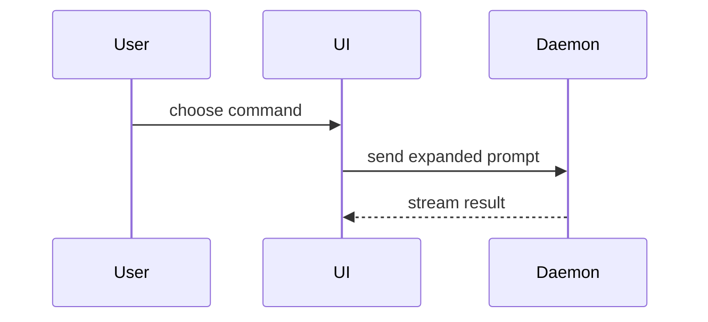

# Summary visuals

An optional visual under `## Summary`, for when the shape of the change is faster to see than to read. The default is plain sentences, plus a small diff sketch when it helps. Pick the smallest view that makes the key point, keep only the calls, files, props, states and boundaries that point needs, and place it next to the sentence it supports. One is usual, two is plenty.

- Logic or an algorithm as pseudocode:

```text
on(save)
  if content is unchanged
    return cached result
  write new content
  return fresh result
```

- Runtime control flow as a call tree:

```text
submitForm
  createSession
    persistPrompt
    launchAgent
  navigateToSession
```

- UI structure as a component tree, with the state and module boundaries that matter:

```text
<SessionPage> (apps/example/src/routes/session.tsx)
  useSessionEvents()
  <SessionToolbar>
    <RunSkillButton> (packages/ui)
```

- File responsibility or a broad refactor as a shallow file tree:

```text
src/
├── commands/       # parses user actions
├── sessions/       # owns session state
└── transport/      # sends API requests
```

- Components talking to each other differently, as Mermaid (GitHub renders it):



- A `diff` sketch when the point is what changes and the surrounding shape already exists. Match its shape to the topic.

For a component change:

```diff
 <SessionPage>
   useSessionEvents()
   <SessionToolbar>
+    <RunSkillButton />
   <SessionTimeline>
+    <SkillResultCard />
```

For a file-layout change:

```diff
 src/
 ├── commands/
+│   └── show-me.ts       # expands the slash command
 ├── sessions/
-└── transport.ts
+└── transport/
+    ├── client.ts
+    └── stream.ts
```

For a call-tree change:

```diff
 submitForm
   createSession
     persistPrompt
+    expandSkillMention
     launchAgent
-  navigateToSession
+  navigateToSession
+    subscribeToEvents
```

For a state or control-flow change:

```diff
 on(save)
-  write content
+  if content is unchanged
+    return cached result
+  write new content
+  invalidate cache
```

- The whole block when most of it is new, or when leaving context out would hide ownership or order:

```ts
function expandSkill(command: string): string {
  const skillName = command.slice(1);
  return `use the ${skillName} skill`;
}
```

## HTML visual

For the rare change that needs something richer (a layout or state comparison, a dense concept Mermaid can't hold), and only when it saves the reviewer real time. GitHub won't render HTML in a PR body, so the HTML becomes an image:

1. Write one focused file, `$SCRATCH/summary-<topic>.html`: a diagram or infographic. Match the product's colors, type and spacing, and use real labels and data.
2. Open it in the browser at a viewport that fits it and screenshot it to `$SCRATCH/summary-<topic>.png`.
3. Open the PNG to check it reads at GitHub's width, then reference it in Summary and pass it to `--attach` like any screenshot.
